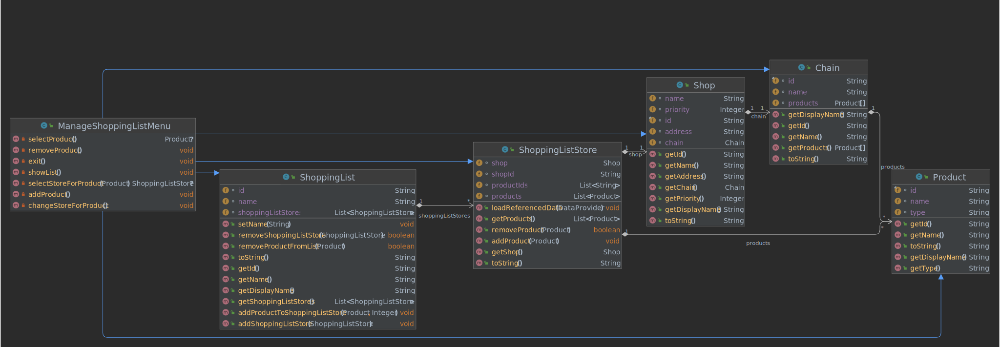

Programmentwurf
Einkaufsmanager

Name: Gombar, Daniel

Martrikelnummer: 6902907


Abgabedatum: 29.05.2022


Allgemeine Anmerkungen: 
    • es darf nicht auf andere Kapitel als Leistungsnachweis verwiesen werden (z.B. in der Form “XY wurde schon in Kapitel 2 behandelt, daher hier keine Ausführung”)
    • alles muss in UTF-8 codiert sein (Text und Code)
    • sollten mündliche Aussagen den schriftlichen Aufgaben widersprechen, gelten die schriftlichen Aufgaben (ggf. an Anpassung der schriftlichen Aufgaben erinnern!)
    • alles muss ins Repository (Code, Ausarbeitung und alles was damit zusammenhängt)
    • die Beispiele sollten wenn möglich vom aktuellen Stand genommen werden
        ◦ finden sich dort keine entsprechenden Beispiele, dürfen auch ältere Commits unter Verweis auf den Commit verwendet werden 
        ◦ Ausnahme: beim Kapitel “Refactoring” darf von vorne herein aus allen Ständen frei gewählt werden (mit Verweis auf den entsprechenden Commit)
    • falls verlangte Negativ-Beispiele nicht vorhanden sind, müssen entsprechend mehr Positiv-Beispiele gebracht werden
        ◦ Achtung: werden im Code entsprechende Negativ-Beispiele gefunden, gibt es keine Punkte für die zusätzlichen Positiv-Beispiele
        ◦ Beispiele
            ▪ “Nennen Sie jeweils eine Klasse, die das SRP einhält bzw. verletzt.”
                • Antwort: Es gibt keine Klasse, die SRP verletzt, daher hier 2 Klassen, die SRP einhalten: [Klasse 1], [Klasse 2]
                • Bewertung: falls im Code tatsächlich keine Klasse das SRP verletzt: volle Punktzahl ODER falls im Code mind. eine Klasse SRP verletzt: halbe Punktzahl
    • verlangte Positiv-Beispiele müssen gebracht werden
    • Code-Beispiel = Code in das Dokument kopieren

      
# Kapitel 1: Einführung

## Übersicht über die Applikation
[Was macht die Applikation? Wie funktioniert sie? Welches Problem löst sie/welchen Zweck hat sie?]

[Github Repository](https://github.com/SuperLonci/advanced-shopping-list)

Es handelt sich um die neuste und innovativste Erfindung in der Geschichte des Einkaufens. 
Sie ermöglicht eine Zuteilung der benötigten Produkte auf die Geschäfte in denen man sie am liebsten erwerben möchte. 
Darüber hinaus werden vervollständigte Eingaben vorgeschlagen. So muss man nur `Kart` eingeben um seine lokalen Lieblingskartoffeln vorgeschlagen zu bekommen. 
Anschließen wird man vor die Auswahl gestellt in welcher Kette man das Produkt erwerben möchte, vorausgesetzt diese bietet es an.
Sie löst das Problem einer unstrukturierten Einkaufsliste und dem Gefühl die ganze Zeit über Produkte der Einkaufliste "drüber" lesen zu müssen, da das Geschäft diese nicht anbietet.
Gleichzeitig kann so mehr Wert auf lokale Produkte gelegt werden und der Lieblingsmetzger um die Ecke zum Fleischkauf gewählt werden.

Workflow:
1. Anwendung starten

2. Wenn:

    bereits eine Einkaufsliste existiert:
    - Einkaufsliste auswählen

    noch keine Einkaufsliste existiert:
    - Einkaufsliste erstellen und auswählen

3. Manage Shopping List wählen
4. Produkt hinzufügen/entfernen/ändern
5. Liste anzeigen


## Wie startet man die Applikation?
[Wie startet man die Applikation? Welche Voraussetzungen werden benötigt? Schritt-für-Schritt-Anleitung]

- Java 11+ muss installiert sein
- Source-Code von [Github](https://github.com/SuperLonci/advanced-shopping-list) herunterladen. Link: https://github.com/SuperLonci/advanced-shopping-list
- kompilieren und ausführen

oder:
- advanced-shopping-list-x.x.jar im Terminal starten

## Wie testet man die Applikation?
[Wie testet man die Applikation? Welche Voraussetzungen werden benötigt? Schritt-für-Schritt-Anleitung]

- Maven und Java müssen vorhanden sein
- Mit dem Befehl `mvn clean test` können alle Tests durchgeführt werden.


# Kapitel 2: Clean Architecture
## Was ist Clean Architecture?
[allgemeine Beschreibung der Clean Architecture in eigenen Worten]
Klar strukturierter Aufbau der Anwendung, der sich sinnbildlich wie eine Zwiebel beschreiben lässt. So sind die verschiedenen Layer aufeinander aufbauend.
Diese ist dadurch sehr anpassungsfähig und ermöglicht eine technologische Unabhängigkeit vom Kern der Anwendung. 

## Analyse der Dependency Rule
[(1 Klasse, die die Dependency Rule einhält und eine Klasse, die die Dependency Rule verletzt);   jeweils UML der Klasse und Analyse der Abhängigkeiten in beide Richtungen (d.h., von wem hängt die Klasse ab und wer hängt von der Klasse ab) in Bezug auf die Dependency Rule]
Es gibt keine Klasse die die Dependency Rule verletzt.

### Positiv-Beispiel: Dependency Rule

`ManageShoppingListMenu` erbt von `MenuBase`, welches eine Dependency auf `Application` hat. `Application` wiederum hat eine Dependency auf die Domain-Klasse `ShoppingList`. Alle Dependencies gehen demnach von außen nach innen.

### weiteres Positiv-Beispiel: Dependency Rule

Die Plugin-Klasse `BinaryStreamShoppingListRepository` erbt vom Application-Interface `ShoppingListRepository`. Die `Application` Klasse besitzt eine Dependency auf dieses Interface, welches in der gleichen Schicht liegt. `Application` wiederum hat eine Dependency auf die Domain-Klasse `ShoppingList`. Auch hier gehen alle Dependencies von außen nach innen, allerdings besitzt `Application` eine Runtime-Dependency auf `BinaryStreamShoppingListRepository`, was allerdings nicht der Dependency-Rule widerspricht. 

## Analyse der Schichten
[jeweils 1 Klasse zu 2 unterschiedlichen Schichten der Clean-Architecture: jeweils UML der Klasse (ggf. auch zusammenspielenden Klassen), Beschreibung der Aufgabe, Einordnung mit Begründung in die Clean-Architecture]
### Schicht: Domain

Die Klassen der Domäne Einkaufsliste. Diese besteht aus einer `ShoppingList`, welche mehrere `ShoppingListStore` besitzt, die jeweils einem `Shop` zugeordnet sind. Einem `ShoppingListStore` können mehrere `Product` zugeordnet werden.
Diese beschreiben das Domänenmodell, welches sich am wenigsten ändern wird und deshalb die innerste Schicht bildet von der alle anderen abhängen.

### Schicht: Plugins

Das UI Plugin besteht aus einer zentralen `ConsolerUserInterface` Klasse, welche zu Beginn der Anwendung eine Instanz von `MainMenu` erzeugt, die das Hauptmenü der Anwendung darstellt.
Alle Menüs erben von der Basisklasse `MenuBase`, welche eine Liste von mehreren `MenuItem` besitzt, die in der Konsole dargestellt und vom Nutzer ausgewählt werden können.
Da die Konsole nur eine mögliche Form der graphischen Darstellung bildet und diese theoretisch durch ein Java Swing UI o.Ä. ersetzt werden könnte, befinden sich diese Klassen in der äußersten Schicht als Plugin. 

# Kapitel 3: SOLID
## Analyse Single-Responsibility-Principle (SRP)
[jeweils eine Klasse als positives und negatives Beispiel für SRP;  jeweils UML der Klasse und Beschreibung der Aufgabe bzw. der Aufgaben und möglicher Lösungsweg des Negativ-Beispiels (inkl. UML)]
### Positiv-Beispiel

Die einzige Aufgabe des `ObjectSelectionMenu` besteht darin ein Objekt aus einer Liste auszuwählen.
Da das Menü sonst keine weitere Aufgabe hat, ist das Single-Responsibility-Principle hier erfüllt. 

### Negativ-Beispiel

Als Negativ-Beispiel ist die `Application` Klasse zu nennen. Da diese Klasse alle Funktionalitäten der Anwendung für die Plugins zur Verfügung stellt ist das Single-Responsibility-Principle hier nicht erfüllt. Eine mögliche Verbesserung wäre die einzelnen Funktionalitäten auf Unterklassen aufzuteilen.

## Analyse Open-Closed-Principle (OCP)
[jeweils eine Klasse als positives und negatives Beispiel für OCP;  jeweils UML der Klasse und Analyse mit Begründung, warum das OCP erfüllt/nicht erfüllt wurde – falls erfüllt: warum hier sinnvoll/welches Problem gab es? Falls nicht erfüllt: wie könnte man es lösen (inkl. UML)?]
### Positiv-Beispiel

Durch die Implementierung eines Interfaces, wird die leichte Erweiterung gewährleistet. Beispielsweise können die Daten durch eine andere Klasse, welche den `DataProvider` implementiert eingelesen werden. Dies macht es offen für eine Erweiterbarkeit, ohne das andere Teile des Source Codes angepasst werden müssen. Gleichzeitig ist eine Anpassung von allen, das Interface implementierenden, Klassen äußerst umständlich, falls das Interface geändert werden solle. 
Sinnvoll ist es, falls man anstatt dem Auslesen von Dateien eine Web-API anschließen möchte. Damit wird eine Nutzung der Anwendung über mehrere Plattformen hinweg ermöglicht.

### Negativ-Beispiel

Als Negativbeispiel ist das `MainMenu` zu nennen. Das hinzufügen von Funktionen, kann nur durch eine Erweiterung des Source Codes geschehen. 
Dies könnte man lösen indem man die Menüoptionen von außen modifizierbar macht.


## Analyse Liskov-Substitution- (LSP), Interface-Segreggation- (ISP), Dependency-Inversion-Principle (DIP)
[jeweils eine Klasse als positives und negatives Beispiel für entweder LSP oder ISP oder DIP);  jeweils UML der Klasse und Begründung, warum man hier das Prinzip erfüllt/nicht erfüllt wird]
[Anm.: es darf nur ein Prinzip ausgewählt werden; es darf NICHT z.B. ein positives Beispiel für LSP und ein negatives Beispiel für ISP genommen werden]
### Positiv-Beispiel

Das Liskov-Substitution-Principle ist hier erfüllt, da das `ObjectSelectionMenu` mit jeder Klasse funktioniert die das Interface `Displayable` implementiert.

### Weiteres Positiv-Beispiel

Ein weiteres Positiv-Beispiel für das Liskov-Substitution-Principle sind die Menüs im UI-Plugin. Jedes Menü erbt von der Basisklasse `MenuBase` und das `ConsoleUserInterface` kann dadurch mit jeden gleich agieren.  


# Kapitel 4: Weitere Prinzipien
## Analyse GRASP: Geringe Kopplung
[jeweils eine bis jetzt noch nicht behandelte Klasse als positives und negatives Beispiel geringer Kopplung; jeweils UML Diagramm mit zusammenspielenden Klassen, Aufgabenbeschreibung und Begründung für die Umsetzung der geringen Kopplung bzw. Beschreibung, wie die Kopplung aufgelöst werden kann]

### Positiv-Beispiel

Das `ManageShoppingListMenu` greift nicht direkt auf `ShoppingListRepository` zu, welches von `BinaryStreamShoppingListRepository` implementiert wird. Stattdessen greift es über eine Methode von `Application` darauf zu, wodurch die genau Funktionsweise nicht ausschlaggebend ist -> Black-Box-Prinzip.    

### Negativ-Beispiel

Das Ui ist direkt and die Entity Klassen gekoppelt, anstatt view models zu nutzen.
Nachteil ist, dass man nicht nur die Daten hat die gebraucht werden sondern alle.

## Analyse GRASP: Hohe Kohäsion
[eine Klasse als positives Beispiel hoher Kohäsion; UML Diagramm und Begründung, warum die Kohäsion hoch ist]

Die Klasse `MainMenu` kann als Beispiel hoher Kohäsion aufgeführt, werden da die in dieser Klasse eingebetteten Funktionalitäten, auf die über ihre Methoden zugegriffen wird, viel gemeinsam haben.
Diese werden in `Application` aufgerufen, aus welcher heraus die die Anwendung verändernden Methoden aufgerufen werden. 
Des Weiteren befinden sich die zusammengehörigen Methoden in derselben Quelldatei.


## Don’t Repeat Yourself (DRY)
[ein Commit angeben, bei dem duplizierter Code/duplizierte Logik aufgelöst wurde; Code-Beispiele (vorher/nachher); begründen und Auswirkung beschreiben]

Commit: [3ee29801ca7a5b0f509562e0bd6369893b823093](https://github.com/SuperLonci/advanced-shopping-list/commit/3ee29801ca7a5b0f509562e0bd6369893b823093)

Vorher existierten mehrere Menüklassen welche einen fast gleichen Aufbau hatten. Diese wurden ersetzt durch eine generische Klasse die anstelle der verschiedenen Menüs aufgerufen wird und die entscheidenden Parameter mitgegeben bekommt.
Änderungen im Menu müssen nun nur in der generalisierten Klasse vorgenommen werden.

Vorher:

```Java
public class ProductSelectionMenu extends MenuBase {

    public Product selection;

    public ProductSelectionMenu(Application application, List<Product> products) {
        super(application);

        setMenuHeader("Select a Product: ");
        addItem(new MenuItem("0", "Exit", this::exit));
        for (int i = 0; i < (products.size()); i++) {
            var currentIndex = i;
            addItem(new MenuItem(Integer.toString(currentIndex + 1), products.get(currentIndex).getName(), ()->selectProduct(products.get(currentIndex))));
        }
    }

    private void selectProduct(Product product){
        selection = product;
    }

    private void exit(){
    }
}

public class ShoppingListSelectionMenu extends MenuBase {

    public ShoppingListSelectionMenu(Application application) {
        super(application);

        setMenuHeader("Select a Shopping List: ");

        addItem(new MenuItem("0", "Exit", this::exit));

        List<ShoppingList> list = application.getShoppingListRepository().getAll();
        for (int i = 0; i < (list.size()); i++) {
            var currentIndex = i;
            addItem(new MenuItem(Integer.toString(currentIndex + 1), list.get(currentIndex).getName(), ()->selectShoppingList(list.get(currentIndex))));
        }
    }

    private void selectShoppingList(ShoppingList shoppingList){
        application.setActiveShoppingList(shoppingList);
        System.out.println(application.getActiveShoppingList().getName() + " selected");
    }

    private void exit(){
        running = false;
    }
}
```

Nachher:
```Java
public class ObjectSelectionMenu<T extends Displayable> extends MenuBase {

    public T selection;

    public ObjectSelectionMenu(Application application, List<T> objects) {
        super(application);

        setMenuHeader("Select an entry: ");
        addItem(new MenuItem("0", "Exit", this::exit));
        for (int i = 0; i < (objects.size()); i++) {
            var currentIndex = i;
            addItem(new MenuItem(Integer.toString(currentIndex + 1), objects.get(currentIndex).getDisplayName(), ()->selectObject(objects.get(currentIndex))));
        }
    }

    private void selectObject(T object){
        selection = object;
    }

    private void exit(){
    }

}
```


# Kapitel 5: Unit Tests

## 10 Unit Tests
[Nennung von 10 Unit-Tests und Beschreibung, was getestet wird]
| Unit Test                     | Beschreibung                                              |
| ---                           | ---                                                       |
| testCreateShoppingList        | Erstellen einer ShoppingList                              |
| testDeleteShoppingList        | Löschen einer ShoppingList                                |
| testFindProductWithQuery      | Suchen von Produkten mit Suchbegriff                      |
| testAddProductWithoutStore    | Produkt hinzufügen ohne, dass bereits ein Store existiert |
| testAddProductWithStore       | Produkt hinzufügen wenn bereits ein Store existiert       |
| testRemoveEmptyStores         | Leere Stores automatisch löschen                          |
| testGetOrAddStore             | Abfragen von Stores mit automatischem Hinzufügen          |
| testShopsFromChain            | Alle Shops einer Kette abfragen                           |
| testRemoveProduct             | Produkt aus ShoppingList entfernen                        |
| testChainsOfferingProduct     | Alle Ketten, die ein Produkt anbieten, abfragen           |


## ATRIP: Automatic
Die Tests wurden mithilfe des JUnit Frameworks realisiert, wodurch diese automatisch ausgeführt werden.
Die Tests benötigen außerdem keinerlei User-Input.
## ATRIP: Thorough
### Positiv-Beispiel:
```Java
@Test
public void testCreateShoppingList() {
    // Arrange
    repository.clear();
    var name = "Test Shopping List";

    // Act
    application.createNewShoppingList(name);

    // Assert
    assertEquals(1, repository.getAll().size());
    assertEquals(name, repository.getAll().get(0).getName());
}

@Test
public void testDeleteShoppingList() {
    // Arrange
    repository.clear();
    repository.save(new ShoppingListBuilder("test").build());

    // Act
    application.deleteShoppingList("test");

    // Assert
    assertEquals(0, repository.getAll().size());
}
```
Diese Tests sind thorough, da sie den Hauptanwendungsfall der Anwendung abdecken. Das Erstellen und Löschen von ShoppingLists ist für jeden Nutzer wichtig, weshalb beide Funktionen ausführlich getestet werden.

### Negativ-Beispiel

```Java
@Test
public void testFindProductWithQuery() {
    // Arrange
    var query = "toff";

    // Act
    var result = application.matchProduct(query);

    // Assert
    assertEquals(1, result.size());
}
```
Dieser Test ist nicht sehr gründlich, da hier nur ein Anwendungsfall der Produktsuche getestet wird. Es wird allerdings nicht getestet, was bei einer leeren Suchanfrage passiert, oder wenn mehrere Produkte gesucht werden.

## ATRIP: Professional
### Positiv-Beispiel
```Java
@Test
public void testCreateShoppingList() {
    // Arrange
    repository.clear();
    var name = "Test Shopping List";

    // Act
    application.createNewShoppingList(name);

    // Assert
    assertEquals(1, repository.getAll().size());
    assertEquals(name, repository.getAll().get(0).getName());
}
```
Dieser Test ist sehr leicht verständlich und durch die Arrange-Act-Assert Struktur klar strukturiert. Fehler sind in diesem Test leicht zu finden und zu beheben.
### Negativ-Beispiel
```Java
@Test
public void testGetOrAddStore() {
    // Arrange
    var shoppingList = application.createNewShoppingList("TestGetAddStore");

    // Act
    assertEquals(0, shoppingList.getShoppingListStores().size());

    var store = application.getOrAddShoppingListStore(dataProvider.getShops()[0]);

    assertEquals(1, shoppingList.getShoppingListStores().size());
    assertEquals(store.getShop(), dataProvider.getShops()[0]);
}
```
Dieser Test ist relativ kompliziert. Die Arrange-Act-Assert Struktur ist hier durcheinander gekommen, da zwischen den Assertions nochmal ein Methodenaufruf passiert. Die Assertions selbst sind schwer verständlich, da keine sprechenden Variablennamen existieren, die aussagen, was genau überprüft wird. Besser wäre es, die Bedingungen auszulagern in temporäre Variablen.
## Code Coverage


Die Line-Coverage im gesamten Projekt beträgt 26%, die Branch-Coverage 12%.
Diese Werte sind relativ schlecht, allerdings liegt das daran, dass der größte Teil des Codes im UI-Plugin liegt. Dieses wurde nicht von Unit-Tests abgedeckt, da es sehr aufwändig wäre, den User-Input zu simulieren.
Betrachtet man nur die Application und die Domain liegt die Line-Coverage bei 86% und 75%, was deutlich besser ist. Auch die Branch-Coverage in Application ist mit 72% vergleichsweise gut.

## Fakes und Mocks


Für die Durchführung der Tests wurden 2 Mock-Objekte erstellt: `MockDataProvider` und `MockRepository`. Der Data-Provider stellt verschiedene Produkte und Shops für die Tests zur Verfügung, ohne das dafür XML-Dateien eingelesen werden müssen. Das Repository stellt verwaltet die ShoppingLists, die während den Tests gebraucht werden, ohne diese auf die Festplatte zu persistieren. So können alle Tests ohne Abhängigkeiten von externen Faktoren durchgeführt werden.

# Kapitel 6: Domain Driven Design
## Ubiquitous Language
[4 Beispiele für die Ubiquitous Language; jeweils Bezeichung, Bedeutung und kurze Begründung, warum es zur Ubiquitous Language gehört]
| Bezeichung        | Bedeutung     | Begründung    |
| ---               | ---           | ---           |
| Product           | Ein Produkt ist ein Objekt, welches in einem Geschäft(Shop) käuflich erworben werden kann. Dies wird einer Einkaufsliste hinzugefügt     |               |
| ShoppingListStore | Eine Einkaufsliste besteht aus mehreren Geschäften, welchen Produkte zugeordnet werden um sie in diesem Geschäft zu erwerben. Diese Untergruppierungen sind die Geschäfte/ShoppingListStores. |               |
| ShopppingList     | Eine Einkaufsliste welche aus mehreren Geschäften und diesen zugeordneten Produkten besteht. |        |
| Chain             | Eine Unternehmenskette wie z.B. Rewe welche überwiegend über das gleiche Sortiment verfügt und dieser daher verallgemeinernd für die einzelnen Instanzen eines Geschäfts verwendet werden kann. |               |


## Entities
[UML, Beschreibung und Begründung des Einsatzes einer Entity; falls keine Entity vorhanden: ausführliche Begründung, warum es keines geben kann/hier nicht sinnvoll ist]


Die ShoppingList Objekte haben durch eine einzigartige ID eine eigene Identität und definieren sich darüber. Hier wurde eine Entity gewählt, damit der Nutzer auch über der Lebenszyklus der Applikation hinaus den gleichen Datenbestand zur Verfügung hat. Auch wenn sich die Produkte in der Shoppingliste verändern, bleibt es trotzdem die gleiche Liste. 


## Value Objects
[UML, Beschreibung und Begründung des Einsatzes eines Value Objects; falls kein Value Object vorhanden: ausführliche Begründung, warum es keines geben kann/hier nicht sinnvoll ist]


Die Menu Items haben keine eigene Identität und werden ausschließlich dazu verwendet dem Nutzer Menüoptionen zur Verfügung zu stellen. Sie werden bei jeder Erstellung eines Menüs neu erstellt, sind also nur temporär. 


## Repositories
[UML, Beschreibung und Begründung des Einsatzes eines Repositories; falls kein Repository vorhanden: ausführliche Begründung, warum es keines geben kann/hier nicht sinnvoll ist]


Da es für die Kernfunktionalität unabdingbar ist, müssen die ShoppingLists gespeichert werden, weshalb ein Repository zum Einsatz kommt.
Das `ShoppingListRepository` stellt Methoden zum Abfragen, Speichern und Löschen von ShoppingList Entities zur Verfügung. 


## Aggregates
[UML, Beschreibung und Begründung des Einsatzes eines Aggregates; falls kein Aggregate vorhanden: ausführliche Begründung, warum es keines geben kann/hier nicht sinnvoll ist]


`ShoppingList` und `ShoppingListStore` bilden in dieser Anwendung ein Aggregat, da `ShoppingListStore` nur über die `ShoppingList` zugreifbar ist und sie gemeinsam gespeichert werden. 
Shop und Product gehören nicht dazu, da sie zwar von `ShoppingListStore` referenziert werden, allerdings separat gespeichert werden.


# Kapitel 7: Refactoring
## Code Smells
[jeweils 1 Code-Beispiel zu 2 Code Smells aus der Vorlesung; jeweils Code-Beispiel und einen möglichen Lösungsweg bzw. den genommen Lösungsweg beschreiben (inkl. (Pseudo-)Code)]

### Duplicated Code
An mehreren Stellen wurden eigene spezifizierte Menüs erstellt. Diese wurden durch ein generalisiertes Menü ersetzt.

Commit: [3ee29801ca7a5b0f509562e0bd6369893b823093](https://github.com/SuperLonci/advanced-shopping-list/commit/3ee29801ca7a5b0f509562e0bd6369893b823093)

Vorher:

```Java
public class ProductSelectionMenu extends MenuBase {

    public Product selection;

    public ProductSelectionMenu(Application application, List<Product> products) {
        super(application);

        setMenuHeader("Select a Product: ");
        addItem(new MenuItem("0", "Exit", this::exit));
        for (int i = 0; i < (products.size()); i++) {
            var currentIndex = i;
            addItem(new MenuItem(Integer.toString(currentIndex + 1), products.get(currentIndex).getName(), ()->selectProduct(products.get(currentIndex))));
        }
    }

    private void selectProduct(Product product){
        selection = product;
    }

    private void exit(){
    }
}

public class ShoppingListSelectionMenu extends MenuBase {

    public ShoppingListSelectionMenu(Application application) {
        super(application);

        setMenuHeader("Select a Shopping List: ");

        addItem(new MenuItem("0", "Exit", this::exit));

        List<ShoppingList> list = application.getShoppingListRepository().getAll();
        for (int i = 0; i < (list.size()); i++) {
            var currentIndex = i;
            addItem(new MenuItem(Integer.toString(currentIndex + 1), list.get(currentIndex).getName(), ()->selectShoppingList(list.get(currentIndex))));
        }
    }

    private void selectShoppingList(ShoppingList shoppingList){
        application.setActiveShoppingList(shoppingList);
        System.out.println(application.getActiveShoppingList().getName() + " selected");
    }

    private void exit(){
        running = false;
    }
}
```
Nachher:
```Java
public class ObjectSelectionMenu<T extends Displayable> extends MenuBase {

    public T selection;

    public ObjectSelectionMenu(Application application, List<T> objects) {
        super(application);

        setMenuHeader("Select an entry: ");
        addItem(new MenuItem("0", "Exit", this::exit));
        for (int i = 0; i < (objects.size()); i++) {
            var currentIndex = i;
            addItem(new MenuItem(Integer.toString(currentIndex + 1), objects.get(currentIndex).getDisplayName(), ()->selectObject(objects.get(currentIndex))));
        }
    }

    private void selectObject(T object){
        selection = object;
    }

    private void exit(){
    }

}
```

### Long Method

Commit: [5ecce4987a2845d0584358856d6daf30e1a7e5c3](https://github.com/SuperLonci/advanced-shopping-list/commit/5ecce4987a2845d0584358856d6daf30e1a7e5c3)

Aus `ManageShoppingListMenu` wurden mehrere Funktionen ausgelagert, die eigenständige Abläufe beschreiben. Damit können diese generalisierbar aus mehreren Methoden aufgerufen werden und die einzelnen sind kürzer und übersichtlicher.

So wird jetzt aus `removeProduct` heraus `selectProduct` aufgerufen, um eine Produktauswahl zu tätigen. 


Vorher:
```Java
private void removeProduct(){
    var products = new ArrayList<Product>();
    System.out.println("Enter a product to remove: ");
    for (ShoppingListStore shoppingListStore: application.getActiveShoppingList().getShoppingListStores()) {
        products.addAll(shoppingListStore.getProducts());
    }

    if (products.isEmpty()){
        System.out.println("No product found");
        return;
    }

    var menu = new ObjectSelectionMenu<Product>(application, products);
    menu.run();

    if (menu.selection == null) {
        System.out.println("No product selected");
        return;
    }

    if (application.removeProductFromShoppingList(menu.selection)) {
        System.out.println(menu.selection.getName() + " removed");
        return;
    }
}
```


Nachher:
```Java
private Product selectProduct(){
    var products = new ArrayList<Product>();
    for (ShoppingListStore shoppingListStore: application.getActiveShoppingList().getShoppingListStores()) {
        products.addAll(shoppingListStore.getProducts());
    }

    if (products.isEmpty()){
        System.out.println("No product found");
        return null;
    }

    var menu = new ObjectSelectionMenu<Product>(application, products);
    menu.run();

    if (menu.selection == null) {
        System.out.println("No product selected");
        return null;
    }
    return menu.selection;
}

private void removeProduct(){
    System.out.println("Remove product:");

    var selectedProduct = selectProduct();
    if (selectedProduct == null){
        return;
    }

    if (application.removeProductFromShoppingList(selectedProduct)) {
        System.out.println(selectedProduct.getName() + " removed");
        application.removeEmptyShoppingListStores();
    }
}
```


## 2 Refactorings
[2 unterschiedliche Refactorings aus der Vorlesung anwenden, begründen, sowie UML vorher/nachher liefern; jeweils auf die Commits verweisen]

### Rename Method

Commit: [5ecce4987a2845d0584358856d6daf30e1a7e5c3](https://github.com/SuperLonci/advanced-shopping-list/commit/5ecce4987a2845d0584358856d6daf30e1a7e5c3)

Durch eine Anpassung der Methode hat diese nicht mehr nur einen `Store` angelegt sondern auch überprüft ob bereits ein gleicher existiert.
Demnach war der Name `AddShoppingListStore` nicht mehr korrekt. Deshalb wurde die Methode umbenannt in `getOrAddShoppingListStore`.


Vorher:


Nachher:


```Java
public ShoppingListStore getOrAddShoppingListStore(Shop shop){
    var existingStore = activeShoppingList.getShoppingListStores().stream().filter(store -> store.getShop().equals(shop)).findAny();
    if (existingStore.isPresent()){
        return existingStore.get();
    }

    var store = new ShoppingListStoreBuilder().shop(shop).build();
    activeShoppingList.addShoppingListStore(store);
    saveShoppingList(activeShoppingList);
    return store;
}
```

### Extract Method
Commit: [5ecce4987a2845d0584358856d6daf30e1a7e5c3](https://github.com/SuperLonci/advanced-shopping-list/commit/5ecce4987a2845d0584358856d6daf30e1a7e5c3)

Aus `ManageShoppingListMenu` wurden mehrere Funktionen ausgelagert, die eigenständige Abläufe beschreiben. Damit können diese generalisierbar aus mehreren Methoden aufgerufen werden und die einzelnen sind kürzer und übersichtlicher.

So wird jetzt aus `removeProduct` heraus `selectProduct` aufgerufen, um eine Produktauswahl zu tätigen. 


Vorher:
```Java
private void removeProduct(){
    var products = new ArrayList<Product>();
    System.out.println("Enter a product to remove: ");
    for (ShoppingListStore shoppingListStore: application.getActiveShoppingList().getShoppingListStores()) {
        products.addAll(shoppingListStore.getProducts());
    }

    if (products.isEmpty()){
        System.out.println("No product found");
        return;
    }

    var menu = new ObjectSelectionMenu<Product>(application, products);
    menu.run();

    if (menu.selection == null) {
        System.out.println("No product selected");
        return;
    }

    if (application.removeProductFromShoppingList(menu.selection)) {
        System.out.println(menu.selection.getName() + " removed");
        return;
    }
}
```


Nachher:
```Java
private Product selectProduct(){
    var products = new ArrayList<Product>();
    for (ShoppingListStore shoppingListStore: application.getActiveShoppingList().getShoppingListStores()) {
        products.addAll(shoppingListStore.getProducts());
    }

    if (products.isEmpty()){
        System.out.println("No product found");
        return null;
    }

    var menu = new ObjectSelectionMenu<Product>(application, products);
    menu.run();

    if (menu.selection == null) {
        System.out.println("No product selected");
        return null;
    }
    return menu.selection;
}

private void removeProduct(){
    System.out.println("Remove product:");

    var selectedProduct = selectProduct();
    if (selectedProduct == null){
        return;
    }

    if (application.removeProductFromShoppingList(selectedProduct)) {
        System.out.println(selectedProduct.getName() + " removed");
        application.removeEmptyShoppingListStores();
    }
}
```


# Kapitel 8: Entwurfsmuster
[2 unterschiedliche Entwurfsmuster aus der Vorlesung (oder nach Absprache auch andere) jeweils sinnvoll einsetzen, begründen und UML-Diagramm]

## Entwurfsmuster: Builder-Pattern


Für das Erstellen der verschiedenen Entity-Klassen wurde das Builder-Pattern eingesetzt. Dafür hat jede Klasse eine weitere Klasse, die dessen Builder darstellt. Beispielsweise existiert für die `ShoppingList` Klasse, die Builder-Klasse `ShoppingListBuilder`. Mithilfe dieser Builder können leicht Parameter für das Erstellen von neuen Objekten hinzugefügt werden. Da Java keine optionalen Parameter unterstützt, müssten ohne das Builder-Pattern eigene Konstruktor-Methoden für jede Kombination von Parametern erstellt werden.

## Entwurfsmuster: Mediator

 

Der grundlegende Aufbau der Anwendung folgt dem sogenannten Mediator-Pattern. Bei diesem Pattern läuft die Kommunikation zwischen den Objekten über einen zentralen Anlaufpunkt, sodass es keine Abhängigkeiten zwischen allen Objekten gibt, sondern lediglich mit dem Mediator-Objekt. In diesem Fall ist der Mediator die `Application`-Klasse. Die einzelnen Menüs greifen immer nur über diese Klasse auf die anderen Objekte, wie z.b. das Repository zu. Dadurch wird die genaue Implementierung der Funktionen versteckt und es gibt weniger Abhängigkeiten zwischen den Teilen der Anwendung.